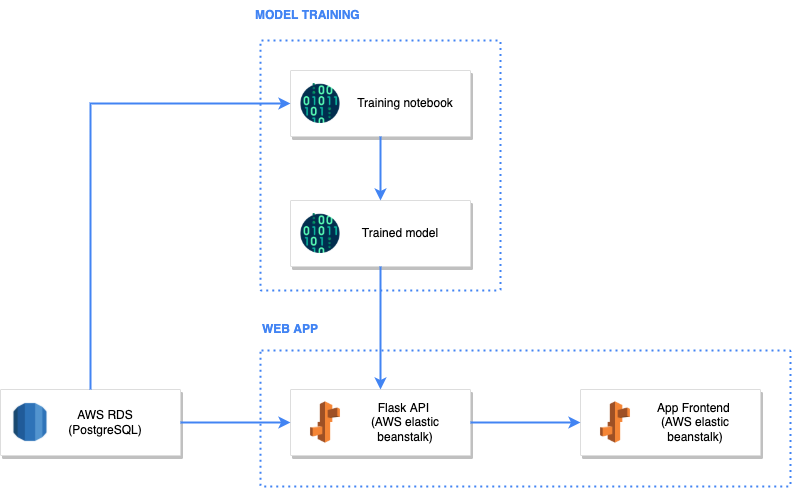

# Purpose and motivation

This repo is an extension of the [weather-etl-aws](https://github.com/jonathanneo/weather-etl-aws) example repo. The weather-etl example provides students of data engineering an example of an end-to-end ETL project that runs on AWS. 

This project, weather-forecast-app, creates a machine learning model to predict weather with 88% accuracy, and allows users to enter inputs and receive a weather forecasted in return. 

The app is hosted on AWS using Elastic Beanstalk (ELB). 

# Repo structure 
```
images/                                     # contains images used for the README
app/    
    |__ _config.template.sh                 # template for adding credentials and secrets 
    |__ _config.template.bat                 # template for adding credentials and secrets 
    |__ app.py                              # contains the main flask app logic and endpoints 
    |__ prediction.py                       # contains the code used to perform the prediction
    |__ requirements.txt                    # python dependencies for app  
README.md                                   # all you need to know is in here 
```

# Solution 

## Solution architecture 

The solution architecture diagram was created using: https://draw.io/ 

Icons were taken from: https://www.flaticon.com/ and https://www.vecta.io/ 




# Running locally 

Follow the steps below to run the code locally: 

- [1. Declare environment variables](#declare-environment-variables)
- [2. Run the application locally ](#run-the-application-locally)


### Declare environment variables 

If you look into the `app/app.py` file, you will see that there are several lines for: 

```python 
DB_USER = os.environ.get("DB_USER")
```

These lines are used to store variables that are either (1) secrets, or (2) change between environments (e.g. dev, test, production). 

We will first need to declare the values for these variables. This can easily be done by running the following in the terminal: 

<b>macOS:</b> 
```
export DB_USER="secret_goes_here"
export DB_PASSWORD="secret_goes_here"
export DB_SERVER_NAME="secret_goes_here"
export DB_DATABASE_NAME="secret_goes_here"
```

<b>windows:</b> 

```
set DB_USER=secret_goes_here
set DB_PASSWORD=secret_goes_here
set DB_SERVER_NAME=secret_goes_here
set DB_DATABASE_NAME=secret_goes_here
```

To save time running each variable in the terminal, you may wish to create script files to store the declaration of each variable. 

- macOS: store the declaration of the variables in a `config.local.sh` file 
    - run using `. ./config.local.sh` 
- windows: store the declaration of the variables in a `config.local.bat` file 
    - run using `config.local.bat` 

### Run the application locally 

To run the application locally, simply run 

```
cd app
python app.py
```

You should see the following which indicates that your app is running locally: 
```
* Serving Flask app 'app' (lazy loading)
* Environment: production
WARNING: This is a development server. Do not use it in a production deployment.
Use a production WSGI server instead.
* Debug mode: on
* Running on http://127.0.0.1:5000/ (Press CTRL+C to quit)
* Restarting with stat
* Debugger is active!
```

